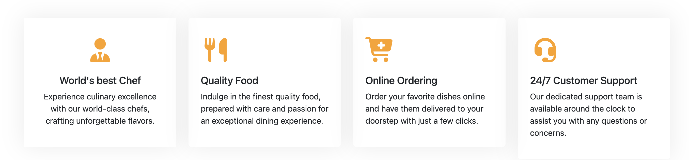
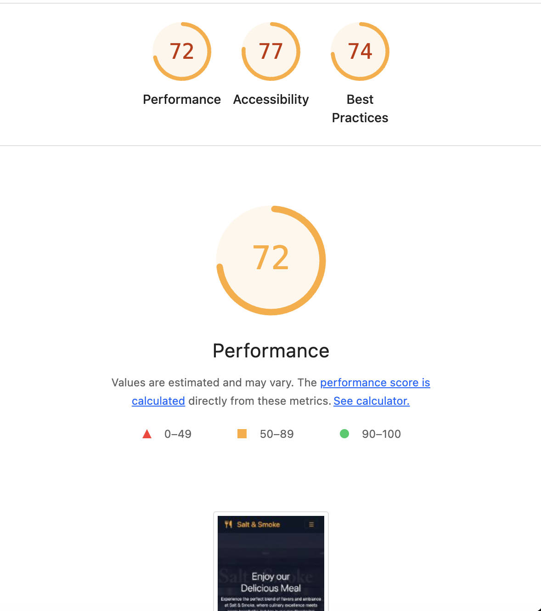

# Salt & Smoke

Salt & Smoke is a responsive restaurant website and portfolio project for a London smokehouse concept.  
The live site combines a branded frontend (`index.html`) with interactive booking/newsletter/feedback UX and a local Express + SQLite API (`server.js`) for data workflows.


## Table of Contents

- [Assessment Rubric Mapping (All)](#assessment-rubric-mapping-all)
- [About the Website](#about-the-website)
- [UX](#ux)
- [User Stories](#user-stories)
- [Acceptance Criteria](#acceptance-criteria)
- [Development Tasks](#development-tasks)
- [Research Before Starting Wireframe Mock-ups](#research-before-starting-wireframe-mock-ups)
- [Wireframe Mock-ups](#wireframe-mock-ups)
- [Features](#features)
- [Typography and Colour Palette](#typography-and-colour-palette)
- [Technologies Used](#technologies-used)
- [Testing](#testing)
- [Manual Testing](#manual-testing)
- [Technologies Used for Testing](#technologies-used-for-testing)
- [Lighthouse for Mobile and Desktop](#lighthouse-for-mobile-and-desktop)
- [W3C HTML Validation](#w3c-html-validation)
- [W3C CSS Validation](#w3c-css-validation)
- [Deployment](#deployment)
- [Credits](#credits)
- [Content](#content)
- [Media](#media)
- [Code](#code)
- [Disclaimer](#disclaimer)
- [Author](#author)

---

## Assessment Rubric Mapping (All)

This README is structured to satisfy common criteria across **Code Institute**, **university coursework/report rubrics**, and **general software project rubrics**.

| Rubric area | Where covered in this README |
|---|---|
| Problem/context and project purpose | About the Website, UX |
| User-centered planning | User Stories, Acceptance Criteria |
| Scope and delivery planning | Development Tasks |
| Discovery and design process | Research Before Starting Wireframe Mock-ups, Wireframe Mock-ups |
| Implemented functionality | Features |
| Visual design system | Typography and Colour Palette |
| Technical implementation | Technologies Used, Code |
| Verification and evidence | Testing, Manual Testing, Technologies Used for Testing |
| Quality/performance/accessibility checks | Lighthouse for Mobile and Desktop, W3C HTML Validation, W3C CSS Validation |
| Release and hosting | Deployment |
| Attribution and compliance | Credits, Content, Media, Disclaimer |


---

## About the Website

Salt & Smoke presents a complete restaurant journey online: discover dishes, check service highlights, browse menu categories, reserve a table, and stay engaged through newsletter and guest feedback.
The site content reflects the project brand identity, including contact details (`+44 20 7946 0958`, `hello@saltandsmoke.co.uk`) and smokehouse-focused messaging.



---

## UX

The UX strategy is conversion-first for Salt & Smoke:
- **Discover quickly:** clear hero message and service value blocks
- **Choose confidently:** searchable/filterable menu with visible counts
- **Act fast:** prominent reservation CTAs in hero, navbar, and footer
- **Stay engaged:** validated newsletter and guest feedback flows

The interaction model is tuned for mobile-first behavior and then scaled for tablet/desktop.


---

## User Stories

| ID | Priority | User story |
|---|---|---|
| US-01 | Must | As a first-time visitor, I want to understand the restaurant concept quickly so I can decide whether to book. |
| US-02 | Must | As a hungry visitor, I want to search and filter the menu so I can find dishes quickly. |
| US-03 | Must | As a customer, I want to book a table with clear validation and feedback so I know my request is submitted correctly. |
| US-04 | Should | As a returning visitor, I want reservation draft data to persist so I do not lose progress. |
| US-05 | Must | As a subscriber, I want newsletter validation feedback so I can correct mistakes immediately. |
| US-06 | Should | As a guest, I want to submit feedback with an image so I can share my experience. |
| US-07 | Must | As a mobile user, I want the navbar to be fully usable so I can navigate all sections easily. |


---

## Acceptance Criteria

| ID | Related stories | Acceptance criteria |
|---|---|---|
| AC-01 | US-01 | The homepage clearly communicates the Salt & Smoke brand and service proposition above the fold. |
| AC-02 | US-07 | On mobile, the navbar opens, navigates to anchors, and collapses correctly after navigation. |
| AC-03 | US-02 | Menu search filters visible items in real time and updates visible count correctly. |
| AC-04 | US-02 | Menu category chips filter items correctly and clear reset restores all items. |
| AC-05 | US-03 | Reservation form blocks invalid submission and shows specific error feedback. |
| AC-06 | US-03 | Valid reservation submission reaches confirmation flow with success messaging. |
| AC-07 | US-04 | Reservation draft values persist through reload and restore correctly. |
| AC-08 | US-05 | Newsletter input validates required/format rules and displays corrective feedback. |
| AC-09 | US-05 | Duplicate newsletter submission returns clear informational feedback. |
| AC-10 | US-06 | Feedback form enforces message/image rules and shows success confirmation after valid submission. |


---

## Development Tasks

| Task ID | Task | Related AC | Status |
|---|---|---|---|
| DT-01 | Build responsive semantic page structure and section navigation | AC-01, AC-02 | Complete |
| DT-02 | Implement interactive menu search, category chips, and reset behavior | AC-03, AC-04 | Complete |
| DT-03 | Implement reservation validation, confirmation flow, and draft persistence | AC-05, AC-06, AC-07 | Complete |
| DT-04 | Implement newsletter validation and duplicate-subscription feedback | AC-08, AC-09 | Complete |
| DT-05 | Implement feedback form validation and success flow | AC-10 | Complete |
| DT-06 | Extend Playwright regression coverage for UX-critical flows | AC-02 to AC-10 | Complete |


---

## Research Before Starting Wireframe Mock-ups

Before wireframing, research for Salt & Smoke focused on:

- Restaurant landing-page patterns and CTA placement.
- Mobile-first interaction priorities.
- Visual hierarchy for menu-heavy hospitality pages.
- Color/contrast standards for accessibility.

This informed the final Salt & Smoke layout flow:
**Hero -> Service Trust Blocks -> Menu Discovery -> Reservation Conversion -> Team Credibility -> Footer CTA + Newsletter/Feedback**


---

## Wireframe Mock-ups

Wireframe planning translated directly into the implemented responsive sections and spacing system used in the live Salt & Smoke pages.


---

## Features

- Responsive Bootstrap-based layout tailored to Salt & Smoke content blocks
- Sticky navigation with active-section highlighting and smooth anchor scrolling
- Strengthened mobile navbar behavior with tested collapse/open navigation flow
- Dynamic daily "Chef's pick" spotlight in menu section
- Menu search + category filter chips + clear filter reset
- Reservation form validation, inline alerts, and local draft persistence
- Newsletter validation (required/format/length) with clear user feedback
- Guest feedback submission with image preview and rotating local photo wall
- Back-to-top control and reduced-motion support


---

## Typography and Colour Palette

- Primary display style: Pacifico + Bootstrap typography system
- Brand colors:
  - Primary: `#fea116`
  - Dark: `#0f1728`
  - Light: `#f1f8ff`


---

## Technologies Used

### Frontend
- HTML5
- CSS3
- JavaScript (ES modules)
- Bootstrap 5.3
- Font Awesome

### Backend/API
- Node.js
- Express 5
- SQLite3
- body-parser
- cors
- dotenv

### Salt & Smoke API endpoints implemented
- `POST /api/reservations`, `GET /api/reservations`, `GET /api/reservations/:id`
- `POST /api/newsletter/signup`, `GET /api/newsletter/signups`
- `POST /api/menu`, `GET /api/menu`, `GET /api/menu/:id`, `PUT /api/menu/:id`, `DELETE /api/menu/:id`
- `GET /api/health`


---

## Testing

Automated end-to-end tests are implemented with Playwright and executed via:

```bash
npm test
```

### Acceptance Criteria Traceability Matrix (Automated)

| AC ID | Playwright test evidence (`tests/site.spec.ts`) | Result |
|---|---|---|
| AC-02 | `stays responsive on mobile and keeps navigation usable` | Pass |
| AC-03 | `searches menu items by name` | Pass |
| AC-04 | `filters menu items by category and can clear filters` | Pass |
| AC-05 | `rejects invalid reservation input with clear feedback` | Pass |
| AC-06 | `handles valid reservation and newsletter input` (reservation portion) | Pass |
| AC-07 | `restores reservation draft after reload (bug-fix regression)` | Pass |
| AC-08 | `rejects invalid newsletter input with clear feedback` | Pass |
| AC-09 | `handles duplicate newsletter subscription without errors (bug-fix regression)` | Pass |
| AC-10 | `rejects invalid feedback input with clear feedback` + `handles valid reservation and newsletter input` (feedback portion) | Pass |

Runtime quality guardrails are also enforced by test hooks that fail on uncaught browser `pageerror` or unexpected console errors.


---

## Manual Testing

Manual checks were executed across mobile/tablet/desktop to complement automated coverage.

| Check ID | Scenario | Related AC | Result |
|---|---|---|---|
| MT-01 | Verify all navbar/footer anchor links navigate to valid sections | AC-01, AC-02 | Pass |
| MT-02 | Verify menu search and category chips in combination | AC-03, AC-04 | Pass |
| MT-03 | Verify reservation errors for empty/invalid/too-short values | AC-05 | Pass |
| MT-04 | Verify reservation success path and submit page confirmation text | AC-06 | Pass |
| MT-05 | Verify reservation draft restore after refresh | AC-07 | Pass |
| MT-06 | Verify newsletter required/format/length messages and success message | AC-08 | Pass |
| MT-07 | Verify duplicate newsletter info feedback | AC-09 | Pass |
| MT-08 | Verify feedback form invalid and valid image/message paths | AC-10 | Pass |
| MT-09 | Verify footer CTAs (`Book now`, `Call us`) on mobile and desktop | AC-01, AC-02 | Pass |


---

## Technologies Used for Testing

- Playwright (`@playwright/test`)
- Browser DevTools responsive mode
- W3C Validators (HTML + CSS)
- Lighthouse / PageSpeed Insights



---

## Lighthouse for Mobile and Desktop

Performance and quality were reviewed with Lighthouse/PageSpeed for both mobile and desktop perspectives.


---

## W3C HTML Validation

HTML markup was validated with the W3C HTML Validator.


---

## W3C CSS Validation

CSS was validated with the W3C CSS Validator.


---

## Deployment

Salt & Smoke frontend is deployed via GitHub Pages:

- https://hamid-aa80.github.io/Salt---Smoke/

Salt & Smoke project repository:

- https://github.com/Hamid-aa80/Salt---Smoke


---

## Credits

- Bootstrap (layout/components)
- Font Awesome (iconography)
- Google Fonts (Pacifico branding style)
- WOW.js (scroll reveal animations)
- Express + SQLite (API and persistence)
- Playwright (automated end-to-end validation)


---

## Content

All copy is written/adapted specifically for Salt & Smoke (smokehouse positioning, menu presentation tone, booking-focused CTAs, and hospitality messaging).


---

## Media

Salt & Smoke media assets used in implementation and documentation are stored in:

- `assets/img/`
- `README-img/`

Media supports responsive presentation and documentation evidence.


---

## Code

Primary Salt & Smoke implementation files:

- `index.html`, `submit.html`
- `style.css`
- `main.js`
- `server.js`
- `tests/site.spec.ts`


---

## Disclaimer

Salt & Smoke is a portfolio/educational project.  
Brand copy, visuals, and implementation are for demonstration purposes; any commercial reuse should verify licensing/ownership for all content and media assets.


---

## Author

Built by Hamid.
