# Salt & Smoke
---

Salt & Smoke is an interactive restaurant web application built as a portfolio project. It helps users browse dishes, book a table, subscribe to updates, and submit feedback in a fast, mobile-friendly experience.

## Quick Start
---

```bash
npm install
npm start
```

- App/API: `http://localhost:5000/api`
- API docs: `http://localhost:5000/api/docs`

## Table of Contents
---

- [Quick Start](#quick-start)
- [Live Links](#live-links)
- [Project Purpose](#project-purpose)
- [Target Audience](#target-audience)
- [User Goals](#user-goals)
- [Business and Site Owner Goals](#business-and-site-owner-goals)
- [User Stories](#user-stories)
- [Core Features (Brand Experience)](#core-features-brand-experience)
- [Future Features](#future-features)
- [Wireframes](#wireframes)
- [Color Scheme](#color-scheme)
- [Contrast Checker](#contrast-checker)
- [Technologies Used](#technologies-used)
- [Testing](#testing)
- [Screenshots](#screenshots)
- [Deployment (Original Process Notes)](#deployment-original-process-notes)
- [Credits](#credits)
- [Purpose and Value](#purpose-and-value)
- [Features (Application)](#features-application)
- [Development Cycle (Documented with Commit Evidence)](#development-cycle-documented-with-commit-evidence)
- [Code Separation and External-Source Attribution](#code-separation-and-external-source-attribution)
- [Technologies](#technologies)
- [Installation and Usage](#installation-and-usage)
- [Project Structure](#project-structure)
- [Deployment (Current)](#deployment-current)
- [Disclaimer](#disclaimer)
- [Author](#author)

## Live Links
---

- **Live site:** https://hamid-aa80.github.io/Salt---Smoke/
- **Repository:** https://github.com/Hamid-aa80/Salt---Smoke

## Project Purpose
---

🎯 Project Purpose (Clear Definition)

• Why is this project being undertaken?
• What problem, need, or opportunity does it address?

🧩 What a Strong Project Purpose Includes
A well‑defined project purpose typically covers:
• The need or problem the project addresses
• The value it will create (financial, operational, customer, strategic)
• The objectives the project must achieve
• The boundaries of what is and isn’t included
• The stakeholders and why it matters to them

💡 Why Project Purpose Matters
A clear purpose:
• Aligns stakeholders around a shared understanding
• Guides decisions throughout the project lifecycle
• Prevents scope drift and misalignment
• Motivates teams by showing the bigger picture

📝 Example of a Project Purpose Statement
“This project aims to redesign the company website to improve customer experience, increase online conversions, and strengthen brand credibility. It addresses declining engagement metrics and supports the company’s strategic goal of expanding digital presence.”

## Target Audience
---

🎯 Salt & Smoke — Target Audience Overview


❤️ 1. Couples Seeking Premium Date‑Night Experiences
Your strongest, most natural audience segment.
• Ages 24–45
• Looking for intimate, warm, cinematic dining
• Prefer low‑light, bokeh ambience, and premium service
• Celebrate anniversaries, first dates, “just because” nights
• Love curated cocktails, wine, and fire‑kissed dishes

🔥 2. Young Professionals & Food‑Lovers
People who appreciate craft cooking and premium visuals.
• Ages 22–40
• Follow food trends, smokehouse culture, and premium dining
• Love visually striking dishes (perfect for social sharing)
• Value quality ingredients and bold flavours
• Seek restaurants with a strong brand identity

🍻 3. Social Groups & Small Gatherings
Friends who want a stylish, warm place to meet.
• Ages 25–45
• After‑work dinners, weekend meetups, small celebrations
• Enjoy craft beer, cocktails, shared plates
• Prefer venues with atmosphere over loud bars

🌙 4. Local Watford Residents Seeking Something “Different”
People tired of the same chain restaurants.
• Ages 28–55
• Want a unique, premium dining option in Watford
• Appreciate independent brands with personality
• Seek quality, consistency, and a memorable environment

📸 5. Aesthetic‑Driven Diners & Content Creators
Your cinematic visuals attract this group naturally.
• Ages 18–35
• Love dark‑premium, moody, fire‑kissed visuals
• Post food, ambience, and date‑night content
• Value design, lighting, and brand storytelling

🧩 6. Special‑Occasion Diners
People celebrating life moments.
• Birthdays
• Anniversaries
• Promotions
• Engagements
• Family milestones

🥃 7. Premium Casual Diners
People who want quality without the stiffness of fine dining.
• Ages 30–55
• Prefer premium but approachable
• Value comfort, warmth, and great service
• Enjoy bold flavours and curated drinks


## User Goals
---

🎯 Salt & Smoke — User Goals

❤️ 1. To Have a Memorable Date Night
Your guests want a place that feels intimate, cinematic, and special.
They want to connect, talk, lean in, and feel the moment.
→ Date‑night experience

🔥 2. To Enjoy Fire‑Kissed, High‑Quality Food
They want bold flavours, premium ingredients, and dishes that feel crafted, not generic.
They want to taste the smoke, the char, the heat.
→ Signature food experience

🌙 3. To Escape Into a Cinematic Atmosphere
Your dark‑premium ambience is a mood.
Guests want to feel transported — warm lighting, bokeh, shadows, fire.
→ Cinematic ambience

🍷 4. To Celebrate Something Special
Birthdays, anniversaries, promotions, first dates, reunions.
They want a place that feels worthy of the moment.
→ Special‑occasion experience

📸 5. To Experience a Visually Stunning Environment
Your guests love the aesthetic — the visuals matter.
They want a place that looks like a film scene and photographs beautifully.
→ Aesthetic‑driven dining

🥃 6. To Relax in a Premium but Comfortable Space
Not stiff fine dining.
Not loud casual dining.
A warm, elegant middle ground.
→ Premium‑casual comfort

🧑‍🤝‍🧑 7. To Feel Looked After
Guests want attentive, warm, human service.
Not rushed. Not robotic.
They want to feel seen.
→ Hospitality experience

🎬 8. To Leave With a Lasting Impression
They want the night to feel like a memory — something they’ll talk about.
Your brand is built for that.
→ Brand emotional impact


## Business and Site Owner Goals
---

🎯 Salt & Smoke — Business & Site Owner Goals

🔥 1. Deliver a Distinctive, Premium Dining Experience
You want Salt & Smoke to stand out in Watford as a unique, cinematic, fire‑kissed smokehouse.
This means:
• Consistent ambience
• Signature flavours
• Memorable service
• A recognisable brand identity
→ Premium dining experience

💷 2. Achieve Strong, Predictable Revenue
The business must generate stable income through:
• High‑value date‑night bookings
• Weekend peak performance
• Consistent weekday traffic
• Upsells (cocktails, wine, desserts)
• Special events
→ Revenue strategy

🍽️ 3. Build a Loyal, Returning Customer Base
Repeat customers are the backbone of a successful restaurant.
Your goal is to create a place people return to for:
• Date nights
• Birthdays
• Anniversaries
• Celebrations
• “Just because” evenings
→ Customer loyalty plan

🌙 4. Establish a Recognisable, Cinematic Brand
Salt & Smoke should be instantly identifiable by its:
• Dark‑premium visuals
• Fire‑kissed identity
• Bokeh ambience
• Elegant typography
• Emotional storytelling
→ Brand identity

👨‍🍳 5. Maintain High Food Quality & Consistency
Your goal is to ensure every dish is:
• Fire‑kissed
• Bold in flavour
• Beautifully plated
• Consistent every time
→ Food quality standards

🧑‍🤝‍🧑 6. Build a Strong, Motivated Team
A great restaurant is built on great people.
Your goals include:
• Hiring skilled, warm staff
• Training them in premium hospitality
• Creating a positive, stable work culture
→ Staff training plan

📍 7. Position Salt & Smoke as a Watford Destination
You want the restaurant to become:
• A go‑to date‑night spot
• A local favourite
• A place people recommend
• A destination worth travelling for
→ Local positioning

📸 8. Leverage Visual Content to Drive Bookings
Your cinematic style is a business asset.
Your goals include:
• High‑quality video content
• Premium photography
• Strong social presence
• Visual storytelling that converts viewers into diners
→ Content strategy

🧩 9. Ensure Operational Efficiency & Smooth Service
Behind the scenes, your goals include:
• Fast table turnover (without rushing guests)
• Smooth kitchen workflow
• Reliable supply chain
• Cost control
• Minimal waste
→ Operational plan

🚀 10. Build a Scalable Concept for Future Expansion
Salt & Smoke should be designed with growth in mind:
• Second location potential
• Franchise or flagship model
• Expandable brand identity
• Replicable ambience and menu
→ Expansion strategy

## User Stories
---

🔥 Salt & Smoke — User Stories

❤️ 1. Date‑Night Couple
• As a couple, I want a warm, intimate table, so that we can connect and enjoy a romantic evening together.
• As a partner, I want the ambience to feel cinematic, so that the night feels special and memorable.
• As a guest, I want beautifully presented, fire‑kissed dishes, so that the food becomes part of the experience.

🔥 2. Food‑Lover / Young Professional
• As a food lover, I want bold, smoky flavours, so that I feel I’m eating something crafted and unique.
• As a young professional, I want a premium but relaxed environment, so that I can unwind after work without feeling rushed.
• As a diner, I want consistent quality, so that I trust the restaurant every time I visit.

🍷 3. Social Group / Friends
• As a group of friends, I want a stylish place to meet, so that we can enjoy a night out that feels elevated.
• As a guest, I want great cocktails and sharable dishes, so that the evening feels social and fun.

🎉 4. Special‑Occasion Guest
• As someone celebrating, I want the atmosphere to feel premium, so that my occasion feels important.
• As a host, I want smooth service, so that my guests feel looked after.

📸 5. Aesthetic‑Driven Guest / Content Creator
• As a content creator, I want visually stunning lighting and plating, so that I can capture beautiful photos and videos.
• As a guest, I want the environment to feel cinematic, so that the experience feels share‑worthy.

🥃 6. Premium‑Casual Diner
• As a diner, I want premium food without fine‑dining stiffness, so that I feel comfortable and relaxed.
• As a regular, I want friendly, warm staff, so that I feel welcomed every time I visit.

🌙 7. Local Resident
• As a local, I want a unique restaurant in Watford, so that I don’t have to travel far for a premium experience.
• As a returning guest, I want consistency, so that Salt & Smoke becomes my go‑to spot.

## Core Features (Brand Experience)
---

🔥 Salt & Smoke — Core Features

🍽️ Fire‑Kissed Signature Menu
• Smoked, charred, flame‑finished dishes
• Premium ingredients
• Bold, layered flavours
• Consistent plating and presentation
This is the heart of the brand.

🌙 Dark‑Premium Cinematic Ambience
• Low, warm lighting
• Candle bokeh
• Soft smoke drift
• Fire reflections
• Matte‑black textures
The restaurant feels like a film scene.

❤️ Date‑Night Focused Seating
• Intimate table spacing
• Romantic lighting
• Quiet, warm atmosphere
• Designed for connection
Your strongest audience segment.

🥃 Premium Drinks Experience
• Curated cocktails
• Quality wines
• Craft beers
• Elegant glassware
• Fire‑kissed garnishes
Premium taste, casual attitude.

🎧 Cinematic Soundscape
• Warm ambient hum
• Subtle fire crackle
• Low‑tempo background music
• No harsh highs or loudness
Sound completes the mood.

📸 Visually Stunning Environment
• Photogenic plating
• Cinematic lighting
• Bokeh‑rich backgrounds
• Shadow‑driven compositions
Perfect for organic social sharing.

🧑‍🤝‍🧑 Warm, Human Hospitality
• Friendly, attentive staff
• Knowledgeable but not pushy
• Relaxed tone
• Consistent service rituals
Premium without pretension.

🪑 Premium‑Casual Comfort
• Comfortable seating
• Relaxed pacing
• No fine‑dining stiffness
• No casual‑dining chaos
The perfect middle ground.

🎉 Special‑Occasion Ready
• Birthday and anniversary‑friendly
• Celebration‑ready ambience
• Optional dessert messages
• Staff trained for special moments
A place worth dressing up for.

📱 Modern Digital Experience
• Online booking
• Social‑first content
• Cinematic video marketing
• Seamless communication
Your digital presence matches your physical one.

## Future Features
---

🔥 Salt & Smoke — Signature Food Experience

🍖 1. Fire‑Kissed Cooking
The defining technique of the brand.
• Open‑flame finishing
• Charred edges
• Smoked depth
• Slow‑cooked tenderness
• Ember‑kissed aromatics
Every dish carries the unmistakable signature of flame.

🌫️ 2. Smokehouse Depth
Not overpowering — refined.
• Subtle wood‑smoke layers
• Balanced seasoning
• Slow infusion for tenderness
• Distinct but elegant aroma
Smoke is treated like a seasoning, not a gimmick.

🍽️ 3. Premium Ingredients
Quality is non‑negotiable.
• High‑grade meats
• Fresh, local produce
• House‑made rubs and marinades
• Carefully sourced spices
Premium casual means premium ingredients, always.

🎨 4. Cinematic Plating
The food must look as good as it tastes.
• Dark plates for contrast
• Gold highlights
• Smoke curls on arrival
• Clean, bold presentation
• Bokeh‑friendly compositions
Every dish is a photo moment.

🌶️ 5. Bold, Confident Flavour Profiles
Salt & Smoke is not subtle — it’s intentional.
• Sweet heat
• Deep umami
• Charred caramelisation
• Balanced acidity
• Rich, smoky undertones
Flavour that feels crafted, layered, and memorable.

🥩 6. Hero Dishes With Identity
Your menu has signature stars.
• Brisket
• Flame‑finished chicken
• Smoked burgers
• Charred vegetables
• Fire‑kissed seafood
These become the dishes people talk about.

🍷 7. Perfect Pairings
Food and drink work together.
• Smoke‑friendly wines
• Char‑enhancing cocktails
• Rich, bold beers
• House‑infused spirits
Pairings elevate the entire experience.

❤️ 8. Emotional Eating Experience
Salt & Smoke food is designed to make people feel:
• Warm
• Indulged
• Connected
• Satisfied
• Impressed
It’s comfort food elevated to cinematic dining.

## Wireframe
----

### Wireframe screenshots

### Mobile Device


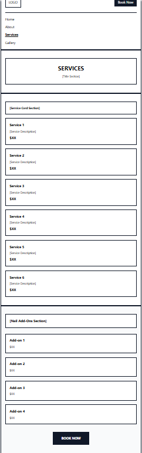


### Tablet Device


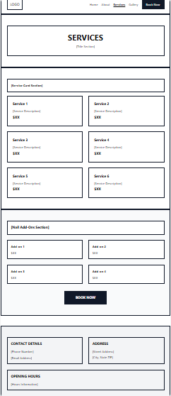


### Desktop Device


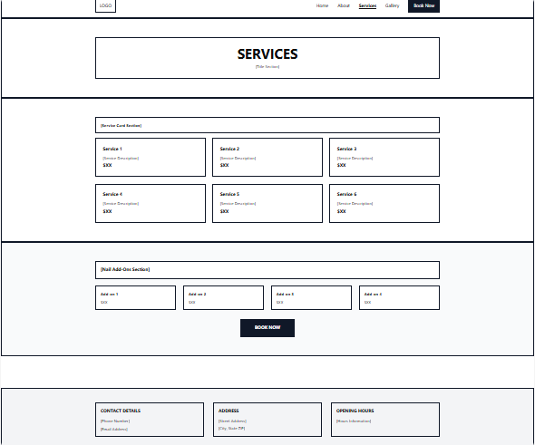


## Color Scheme
---

- #fea116 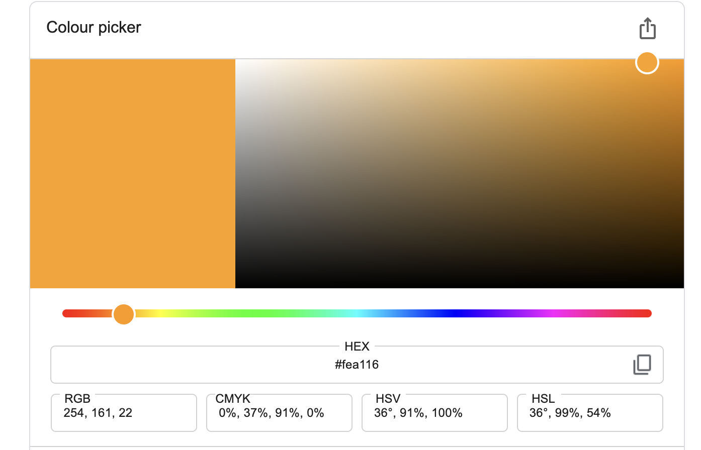

- #f1f8ff 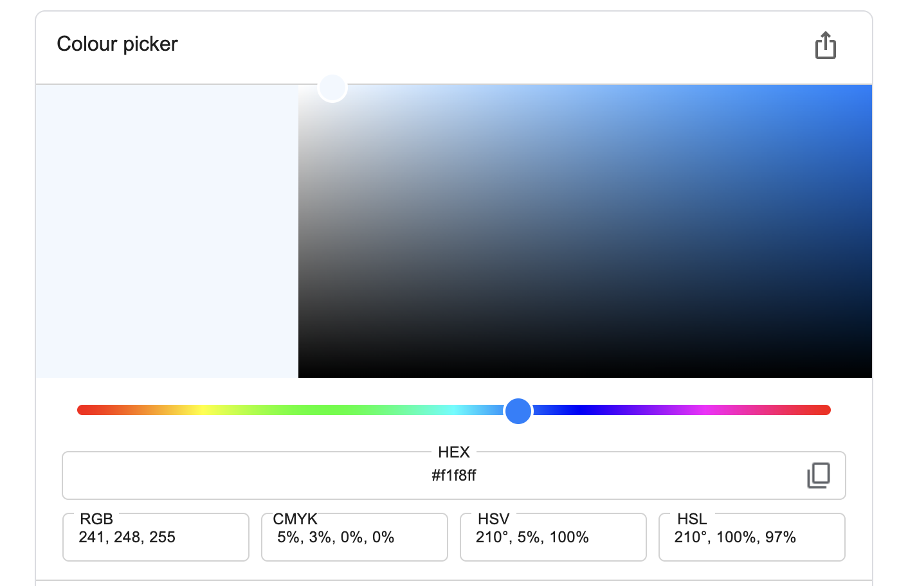

- #0f1728 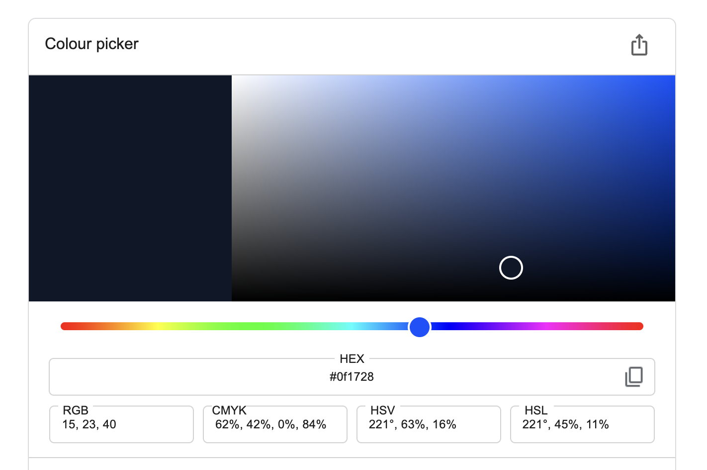

## Contrast Checker


## Technologies Used
---

- HTML
- CSS
- Visual Studio Code
- Bootstrap V5
- Google Fonts
- GitHub
- Figma for wireframes
- Adobe Firefly to generate photos
- Adobe Express to resize images
- FontAwesome
- Favicon
- Contrast Checker
- TinyPNG to convert images to webp

## Testing
---

### Manual Testing

#### Functionality

| Test                         | Test Action                                                                                           | Expected results                                                       | Test results |
| ---------------------------- | ----------------------------------------------------------------------------------------------------- | ---------------------------------------------------------------------- | ------------ |
| Enquiry form                 | Test navigation to enquiry form                                                                       | Navigation to enquiry form was easily accessible and easy to find      | PASS         |
| Test the enquiry form        | Does the enquiry form have the right fields for the correct data to be collected for new clients      | The enquiry form has the correct fields such as Name, Email, Phone etc | PASS         |
| Fill out enquiry form        | Fill out enquiry form, does it display a success message or page                                      | Directed to a success page                                             | PASS         |
| Return button (success page) | Does the return button work on the success page properly                                              | The return button directs you back to the home page                    | PASS         |
| Navigation                   | Test the navigation back and forth from page to page. For example - home to gallery, home to projects | Navigation works correctly                                             | PASS         |

### W3C HTML Test


### W3C CSS Test


My project was deployed using GitHub:

1. My project was pushed to GitHub

2. Repository settings was selected

3. Pages section was selected

4. The main branch was chosen as the deployment source

5. GitHub generated the live site URL

### Lighthouse

#### (index.html) - Desktop


#### (index.html) - Mobile

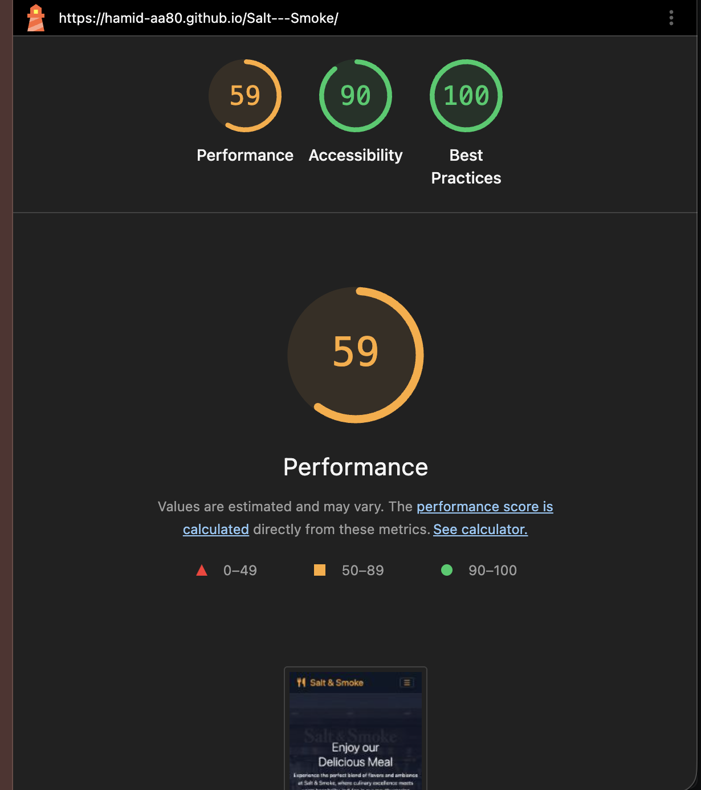

## Screenshots
----

### Navbar


### Homepage


### About page


### Menu Page

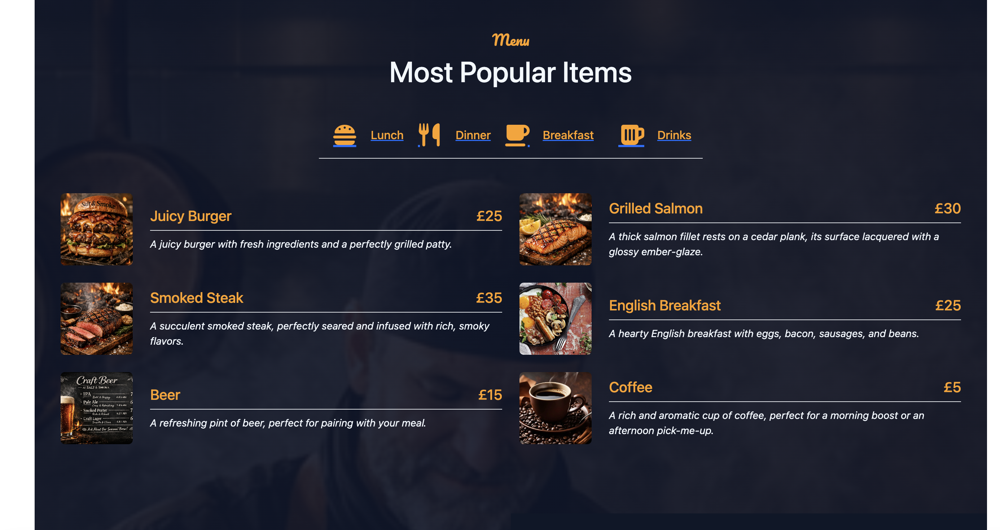

### ReadMore Page

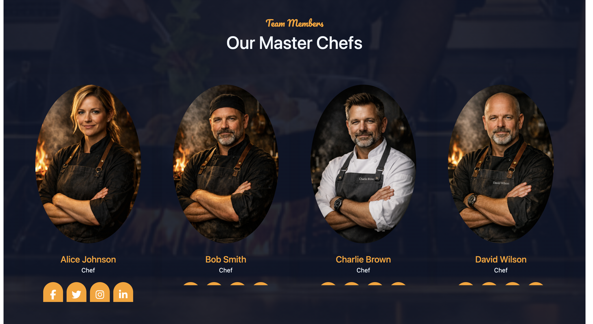

### Reservation Page

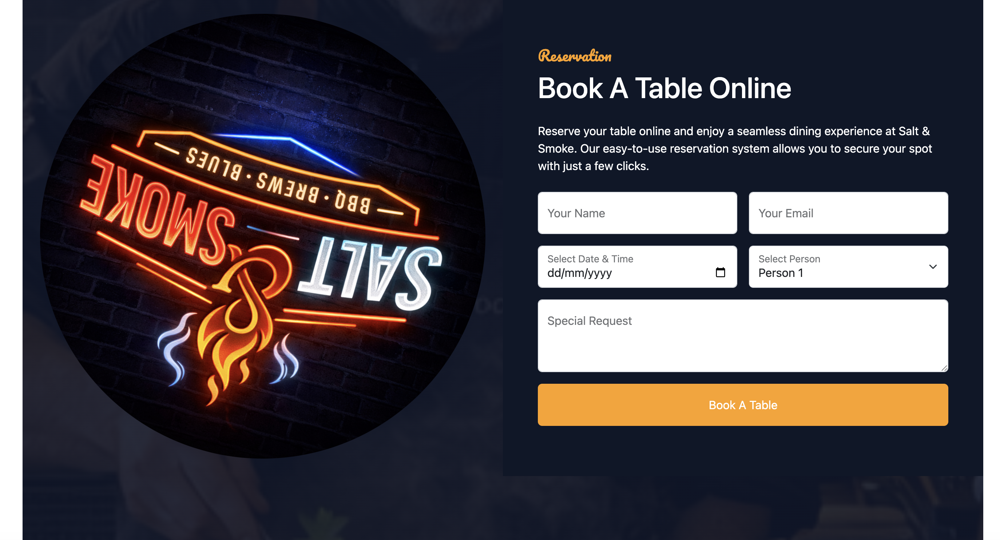

### Contact page


## Deployment (Original Process Notes)
---

This project was developed using [VS Code](https://code.visualstudio.com/), committed to git and pushed to GitHub using the built-in function within VS Code.

This site is hosted using GitHub pages, deployed directly from the master branch. The deployed site will update automatically upon new commits to the master branch. In order for the site to deploy correctly on GitHub pages, the landing page must be named index.html.

These are the steps that can be taken to deploy the page on GitHub Pages from its [GitHub repository](https://hamid-aa80.github.io/Salt---Smoke/):

1. Log into GitHub. 
2. From the list of repositories on the screen, select [https://hamid-aa80.github.io/Salt---Smoke/] 
3. From the menu items near the top of the page, select Settings. 
4. Scroll down to the GitHub Pages section. 
5. Under Source the drop-down menu should display Deploy from a branch 
6. On selecting Main Branch the page is automatically refreshed, the website is now deployed. 
7. Scroll back up to the GitHub Pages section to retrieve the link to the deployed website.


The deployed site can also be found on the repository page on the right-hand side under Deployments.

To run locally, you can clone this repository directly into the editor of your choice by pasting `git clone` into your terminal. This can be found on the main repository page by clicking the **Code** button. To disconnect your local copy from this GitHub repository, type `git remote rm origin` in the terminal.

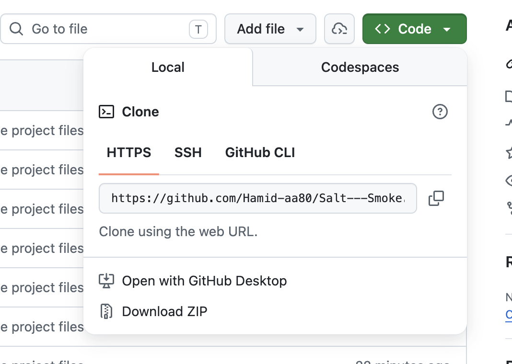

## Credits
---

### Content
- The welcome paragraph on the homepage.
- The testimonials in the reviewing section.
- Products on the products page with discount.

### Code
 - Custom CSS code was written by me.
 - Some HTML was imported directly from Bootstrap V5.3 
 - Grid systems 
 - rows, columns and cards. Navigation bar.

### Media and Photos
- All media and photos sourced from Google.

## Purpose and Value
---

This application is built to deliver practical value to users:

- **Fast reservations:** clear form validation and confirmation flow.
- **Quick menu discovery:** searchable and filterable menu items.
- **Simple communication:** newsletter sign-up with immediate feedback.
- **Ongoing engagement:** feedback submission with optional image upload.


## Features (Application)
---

- Responsive frontend (`index.html`, `style.css`, `main.js`)
- Sticky navbar with active section behavior
- Menu search + category filters + reset state
- Reservation form validation and success handling
- Newsletter validation and duplicate-subscription handling
- Feedback form with image constraints and preview
- Local API with Express + SQLite (`server.js`)
  - `POST /api/reservations`, `GET /api/reservations`, `GET /api/reservations/:id`
  - `POST /api/newsletter/signup`, `GET /api/newsletter/signups`
  - `POST /api/menu`, `GET /api/menu`, `GET /api/menu/:id`, `PUT /api/menu/:id`, `DELETE /api/menu/:id`
  - `GET /api/health`, `GET /api/docs`

## Development Cycle (Documented with Commit Evidence)
---

The project was developed iteratively:

1. **Foundation and UI structure**  
   Built responsive layout and navigation behavior.
2. **Interactive user journeys**  
   Added menu filtering/search, reservation flow, newsletter, and feedback features.
3. **Validation and UX hardening**  
   Strengthened input validation, messaging, and accessibility details.
4. **Automated regression checks**  
   Expanded Playwright tests for critical user flows.
5. **Documentation and repository hygiene**  
   Improved README/API docs and removed generated artifacts from source control.

### Commit-message evidence

| Commit | Message | What it evidences |
|---|---|---|
| `2021e05` | `feat: add API docs route and clean generated artifacts` | API maintenance and repository cleanup |
| `1d11a16` | `feat: enhance README for clarity, structure, and comprehensive assessment mapping` | Documentation improvement |
| `936b4b4` | `feat(tests): enhance test coverage with improved validation and responsiveness checks` | Test coverage growth |
| `0faa2b5` | `feat: enhance newsletter email validation with length checks and error messaging` | Validation refinement |
| `901a40b` | `feat: implement menu category filters with reset functionality and update filter status display` | Interactive menu delivery |
| `cc5b2cc` | `feat: implement guest feedback wall with image support and time formatting` | Feedback feature implementation |

## Code Separation and External-Source Attribution
---

### Custom project code

The following files are written for this interactive application:

- `index.html`
- `submit.html`
- `style.css`
- `main.js`
- `server.js`
- `api-client.js`
- `api-integration-examples.js`
- `tests/site.spec.ts`

### External libraries and sources

The project uses these external dependencies:

- Bootstrap 5.3
- Font Awesome
- Google Fonts (Pacifico)
- WOW.js
- Express
- SQLite3
- Playwright

Attribution is applied in two places:

1. **In code comments:** `index.html` now includes comments above external CDN includes and WOW.js initialization.
2. **In this README:** this section explicitly lists all external dependencies.

## Technologies
---

### Frontend

- HTML5
- CSS3
- JavaScript (ES modules)
- Bootstrap 5.3
- Font Awesome

### Backend/API

- Node.js
- Express 5
- SQLite3
- body-parser
- cors
- dotenv

### Testing

- Playwright (`@playwright/test`)

## Installation and Usage
---

### Prerequisites

- Node.js 18+
- npm

### Install

```bash
npm install
```

### Run API

```bash
npm start
```

API base URL:

- `http://localhost:5000/api`

Health and docs:

- `http://localhost:5000/api/health`
- `http://localhost:5000/api/docs`

### Run tests

```bash
npm test
```

## Project structure
---

```text
index.html
submit.html
style.css
main.js
server.js
api-client.js
api-integration-examples.js
tests/
assets/
README-img/
```

## Deployment (Current)
---

Frontend deployment is on GitHub Pages:

- https://hamid-aa80.github.io/Salt---Smoke/

## Disclaimer
---

This is a portfolio/educational project.

## Author
---

Built by Hamid.
