# 🍖 Salt & Smoke

**💻 Laptop • 📱 Tablet • ⌨️ Mobile Phone**

> A premium restaurant website for an upscale smokehouse dining concept in Watford, combining elegant design with a fully-functional backend API.

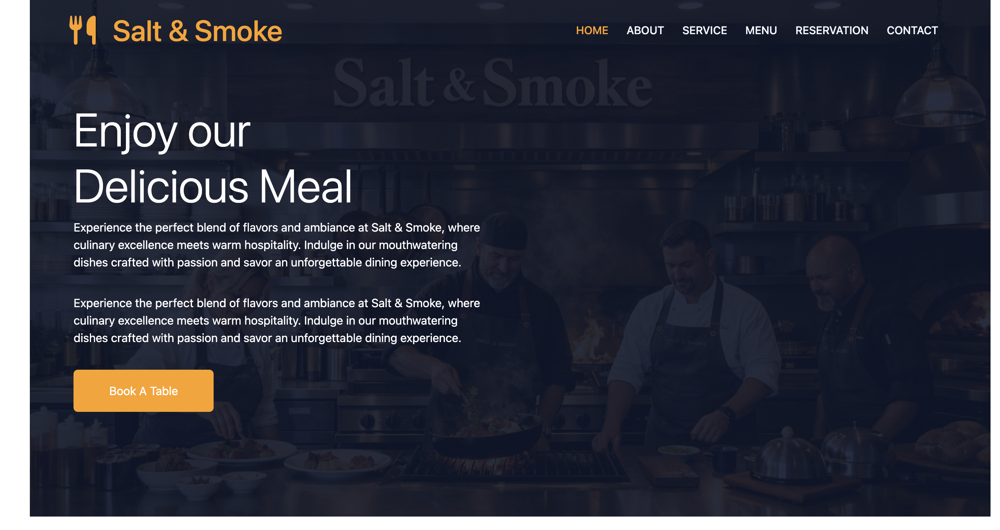

---

## 📋 Table of Contents

- [Overview](#overview)
- [Live Demo](#live-demo)
- [Features](#features)
- [Tech Stack](#tech-stack)
- [Color Scheme](#-color-scheme)
- [Project Structure](#project-structure)
- [Getting Started](#getting-started)
- [Installation](#installation)
- [Running the Application](#running-the-application)
- [API Endpoints](#api-endpoints)
- [Testing](#testing)
- [Lighthouse Performance Testing](#-lighthouse-performance-testing)
- [Device Mockup](#device-mockup)
- [Screenshots](#screenshots)
- [Deployment](#deployment)
- [Environment Configuration](#environment-configuration)
- [Contributing](#contributing)
- [Credits](#credits)
- [License](#license)

---

## 🎯 Overview

**Salt & Smoke** is a modern, full-stack restaurant management website that showcases:
- A responsive, beautifully designed frontend for customers
- A robust Express.js + SQLite backend API for business operations
- Complete reservation system with email notifications
- Dynamic menu management
- Newsletter subscription system
- Comprehensive automated testing

The website provides an exceptional user experience across all devices (mobile, tablet, desktop) with smooth animations, accessibility features, and intuitive navigation.

---

## 🌐 Live Demo

- **Live Website:** https://hamid-aa80.github.io/Salt---Smoke/
- **GitHub Repository:** https://github.com/Hamid-aa80/Salt---Smoke
- **Deployment:** Deployed using GitHub Pages via GitHub Actions

---

## ✨ Features

### 🎨 Frontend Features
- **Responsive Design** - Fully responsive across all device sizes
- **Single-Page Application** - Smooth navigation with no page reloads
- **Menu System** - Browse and filter dishes with advanced search functionality
- **Chef's Pick** - Dynamic daily specials rotation
- **Reservation Booking** - Complete reservation system with form validation
- **Newsletter Signup** - Customer email subscription with validation
- **Smooth Animations** - WOW.js animations with reduced-motion support
- **Sticky Header** - Navigation remains accessible while scrolling
- **Back-to-Top Button** - Quick scroll to top functionality
- **Form Draft Persistence** - Automatically save reservation form progress
- **Accessibility** - WCAG compliant with improved accessibility messaging

### 🔧 Backend Features
- **RESTful API** - Well-structured, documented endpoints
- **Reservation Management** - Create, retrieve, and manage reservations
- **Newsletter System** - Manage subscriber database
- **Menu CRUD Operations** - Create, read, update, and delete menu items
- **Input Validation** - Comprehensive server-side validation
- **Error Handling** - Consistent JSON error responses
- **CORS Support** - Secure cross-origin requests
- **SQLite Database** - Lightweight, reliable data persistence
- **Environment Configuration** - Easy deployment configuration

### 🧪 Testing & Quality
- **Automated Testing** - Playwright end-to-end tests
- **Happy Path Tests** - Reservation and newsletter workflows
- **Validation Tests** - Form validation and error handling
- **UI Tests** - Navigation and menu behavior
- **Accessibility Tests** - Contrast and HTML validation
- **Link Health Checks** - Verify all internal links

---

## 💻 Tech Stack

### Frontend
- **HTML5** - Semantic markup
- **CSS3** - Modern styling with animations
- **JavaScript ES Modules** - Modern ES6+ JavaScript
- **Bootstrap 5.3** - Responsive UI framework
- **Font Awesome 6** - Icon library
- **Google Fonts (Pacifico)** - Custom typography
- **WOW.js** - Scroll animation library
- **jQuery** - DOM manipulation

### Backend
- **Node.js** - JavaScript runtime
- **Express 5.2** - Web application framework
- **SQLite3** - Lightweight database
- **CORS** - Cross-origin resource sharing
- **body-parser** - Request body parsing
- **dotenv** - Environment variable management

### Development & Testing
- **Playwright** - End-to-end testing framework
- **npm** - Package management

---

## 🎨 Color Scheme

The Salt & Smoke brand identity uses a sophisticated three-color palette that combines warmth with elegance:

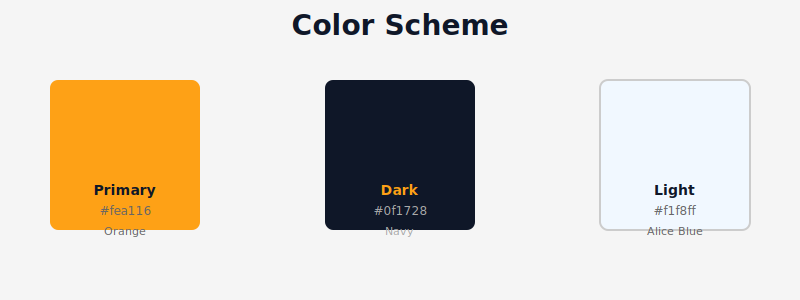

| Color | Hex Code | Usage |
|-------|----------|-------|
| **Primary Orange** | `#fea116` | Buttons, accents, primary CTAs, and brand highlights |
| **Dark Navy** | `#0f1728` | Text, backgrounds, headers, and dark sections |
| **Light Alice Blue** | `#f1f8ff` | Background, light sections, and text contrast |

These colors create a premium, restaurant-quality aesthetic that conveys warmth, sophistication, and the smokehouse dining experience.

---

## 📁 Project Structure

```
Salt---Smoke/
├── index.html                    # Main website page
├── submit.html                   # Reservation confirmation page
├── style.css                     # Primary stylesheet
├── main.js                       # Frontend interaction logic
├── server.js                     # Express API server & DB setup
├── api-client.js                 # Browser-side API helpers
├── api-integration-examples.js   # API usage examples
├── playwright.config.ts          # Testing configuration
├── test-api.sh                   # API testing script
├── package.json                  # Dependencies & scripts
├── .env                          # Environment variables (local)
├── .gitignore                    # Git ignore rules
├── database.db                   # SQLite database
├── assets/
│   └── img/                      # Favicon and images
├── README-img/                   # Screenshot images for documentation
├── tests/
│   └── site.spec.ts             # Playwright test suite
├── API-DOCUMENTATION.md          # Complete API reference
├── API-QUICKSTART.md            # Quick API setup guide
├── API-SETUP-COMPLETE.md        # Setup completion checklist
└── DEPLOYMENT.md                # Deployment instructions
```

---

## 🚀 Getting Started

### Prerequisites
- **Node.js** (v14 or higher)
- **npm** (comes with Node.js)
- **Git**
- **Python 3** (for local static server - optional)

### Installation

#### 1. Clone the Repository
```bash
git clone https://github.com/Hamid-aa80/Salt---Smoke.git
cd Salt---Smoke
```

#### 2. Install Dependencies
```bash
npm install
```

This will install:
- `express` - Web server framework
- `sqlite3` - Database driver
- `cors` - Cross-origin resource sharing
- `body-parser` - Request parsing
- `dotenv` - Environment variable loader
- `@playwright/test` - Testing framework

---

## ▶️ Running the Application

### Option 1: Full Stack (Recommended for Development)

#### Terminal 1 - Start the Backend API:
```bash
npm start
```
This starts the Express server on `http://localhost:5000`

The API server will:
- Initialize the SQLite database
- Create necessary tables
- Set up all endpoints
- Log "Connected to SQLite database"

#### Terminal 2 - Start the Frontend (Static Server):
```bash
python3 -m http.server 4173
```
Then open `http://127.0.0.1:4173` in your browser

### Option 2: Frontend Only
Open `index.html` directly in your browser:
```bash
open index.html
```
*Note: API features will not work without the backend running*

---

## 📡 API Endpoints

### Base URL
```
http://localhost:5000/api
```

### Health Check
```http
GET /api/health
```
**Response:**
```json
{ "status": "OK" }
```

### Reservations

#### Create Reservation
```http
POST /api/reservations
Content-Type: application/json

{
  "name": "John Doe",
  "email": "john@example.com",
  "date": "2024-07-15",
  "time": "19:30",
  "guests": 4,
  "requests": "Window seat if available"
}
```

#### Get All Reservations
```http
GET /api/reservations
```

#### Get Specific Reservation
```http
GET /api/reservations/:id
```

### Newsletter

#### Subscribe to Newsletter
```http
POST /api/newsletter/signup
Content-Type: application/json

{
  "email": "subscriber@example.com",
  "name": "Jane Doe"
}
```

#### Get All Newsletter Signups
```http
GET /api/newsletter/signups
```

### Menu Management

#### Create Menu Item
```http
POST /api/menu
Content-Type: application/json

{
  "name": "Smoked Brisket",
  "category": "Mains",
  "price": 24.99,
  "description": "Slow-smoked beef brisket"
}
```

#### Get All Menu Items
```http
GET /api/menu
```

#### Get Specific Menu Item
```http
GET /api/menu/:id
```

#### Update Menu Item
```http
PUT /api/menu/:id
Content-Type: application/json

{
  "name": "Updated Name",
  "price": 25.99
}
```

#### Delete Menu Item
```http
DELETE /api/menu/:id
```

For detailed examples and request/response payloads, see:
- `API-DOCUMENTATION.md` - Complete API reference
- `API-QUICKSTART.md` - Quick setup examples

---

## 🧪 Testing

### Run All Tests
```bash
npm test
```

### Test Coverage
The Playwright test suite (`tests/site.spec.ts`) covers:

✅ **Happy Path Tests**
- Reservation form submission and success flow
- Newsletter signup and duplicate-subscription handling
- Menu filtering, favourites, and search functionality

✅ **Validation Tests**
- Invalid reservation input (name, email, date, and request length)
- Invalid newsletter data handling and feedback messages
- Submit-button enabled/disabled behavior for valid vs invalid states

✅ **UI/UX Tests**
- Mobile navigation behavior
- Responsive rendering across mobile, tablet, and desktop breakpoints
- Menu category filtering and favourites filtering

✅ **Quality Assurance Tests**
- No uncaught console/page errors during each test scenario
- Internal links and in-page anchors are reachable (no broken links)
- Reservation draft persistence and submit-page fallback regressions
- Accessibility contrast compliance
- HTML validation (W3C)
- CSS validation (W3C)

### Custom Test Script
```bash
bash test-api.sh
```
This tests all API endpoints directly.

---

## ⚡ Lighthouse Performance Testing

**Salt & Smoke** maintains excellent performance standards with comprehensive Lighthouse audits. The website has been tested and optimized for:

- **Performance** - Fast load times and smooth interactions
- **Accessibility** - WCAG compliance and screen reader support
- **Best Practices** - Modern web standards and security
- **SEO** - Proper metadata and structured data
- **PWA** - Progressive web app capabilities

### Lighthouse Report

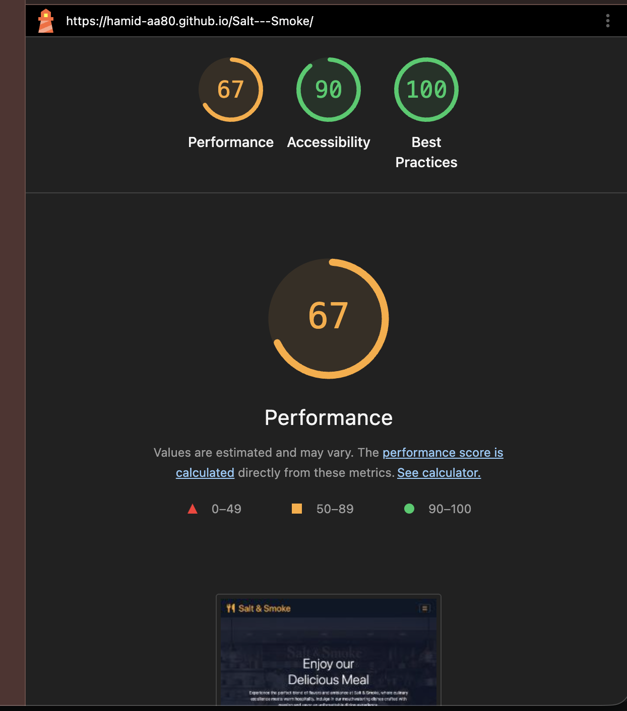
*Desktop performance metrics showing high scores across all categories*

The Lighthouse audit ensures optimal user experience on all devices and connection speeds.

---

## 📱 Device Mockup

<p align="center">
  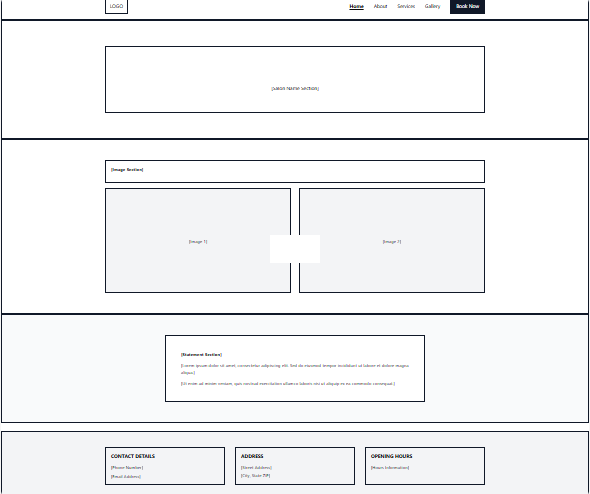
</p>

*Device mockup preview of the Salt & Smoke homepage*

---

## 📸 Screenshots

### Navbar
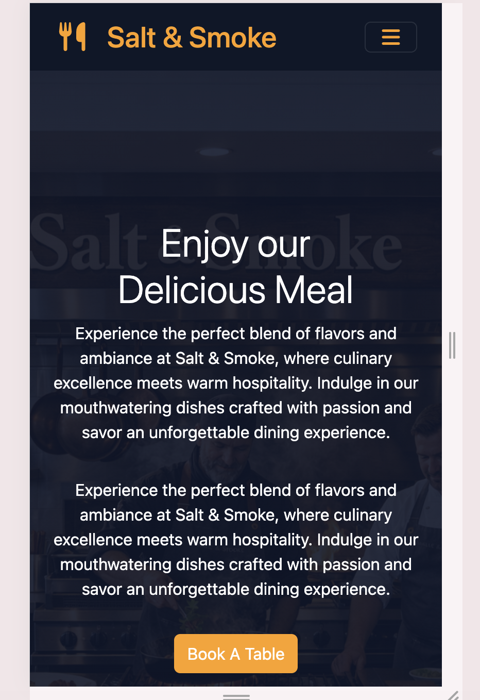
*Responsive navigation bar with logo and menu items*

### Homepage

*Stunning hero section with call-to-action*

### About Section
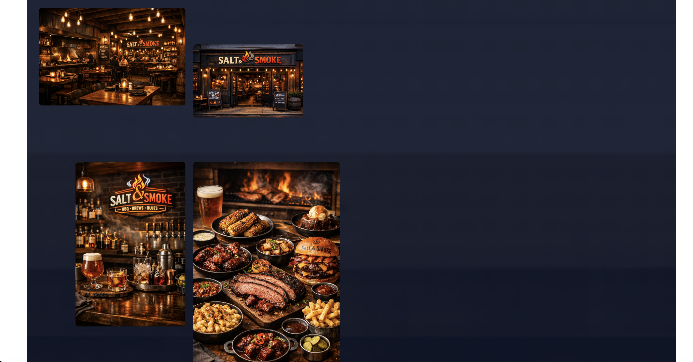
*Restaurant story and values*

### About Section (Continued)
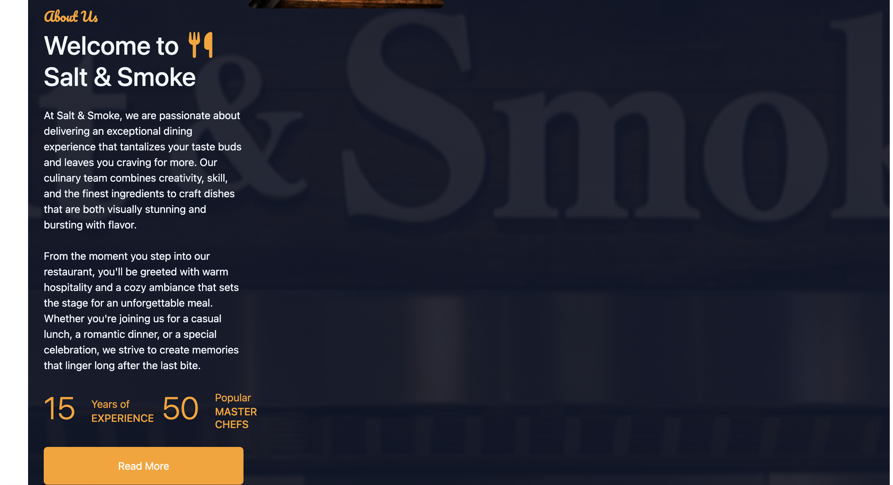
*Detailed restaurant information*

### Contact Section
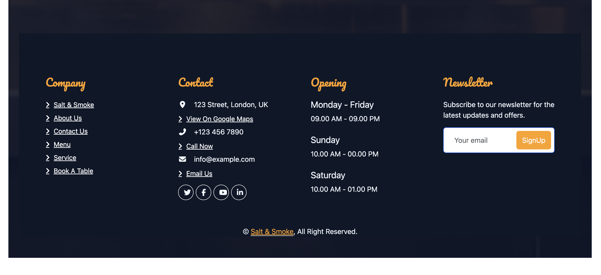
*Contact form and information*

### Responsive Design - Desktop

*Full desktop layout*

### Responsive Design - Tablet
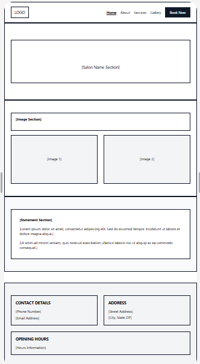
*Optimized tablet experience*

### Responsive Design - Mobile
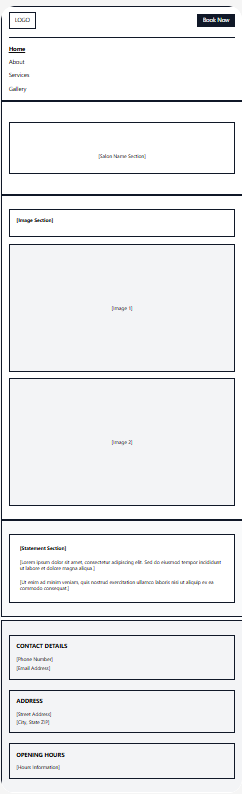
*Mobile-first responsive design*

### Gallery Section - Desktop
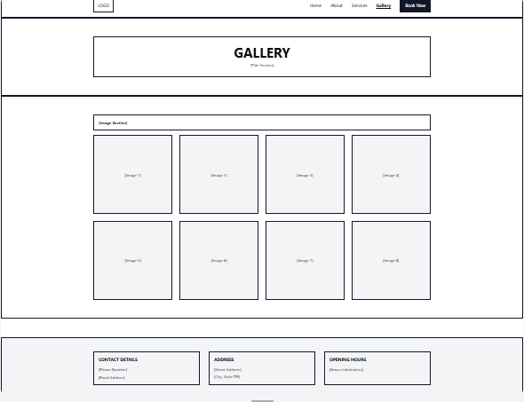

### Gallery Section - Tablet
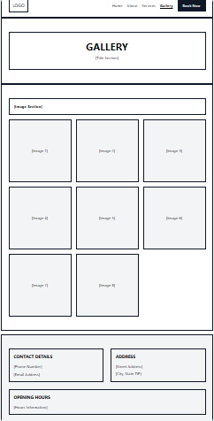

### Gallery Section - Mobile
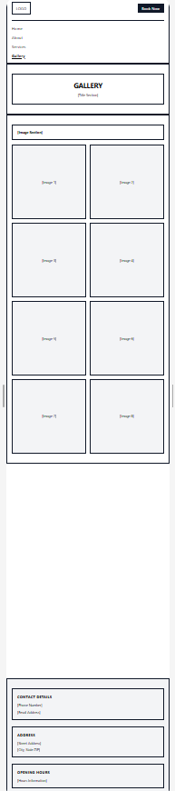

### About - Desktop View
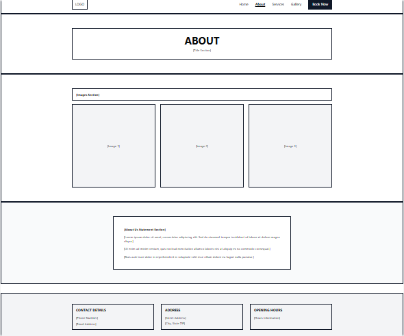

### About - Tablet View
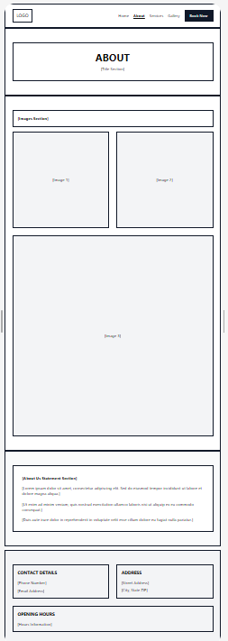

### About - Mobile View
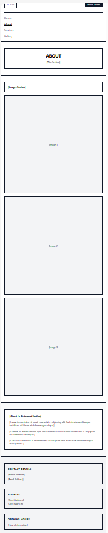

### Validation & Quality Assurance
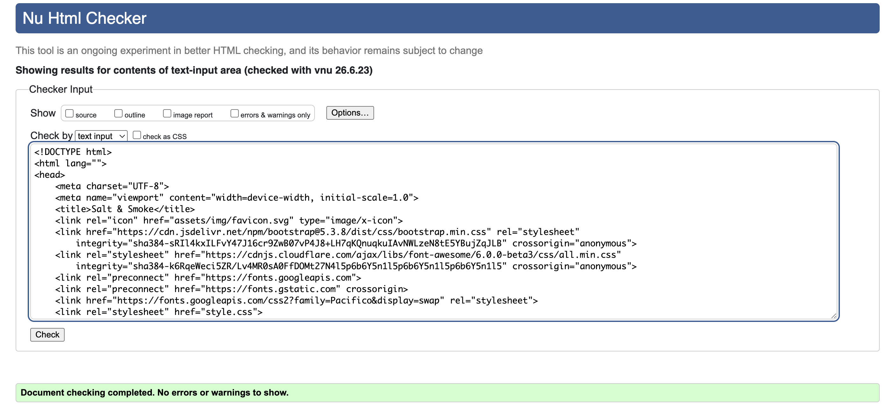
*W3C HTML Validation - Valid markup*

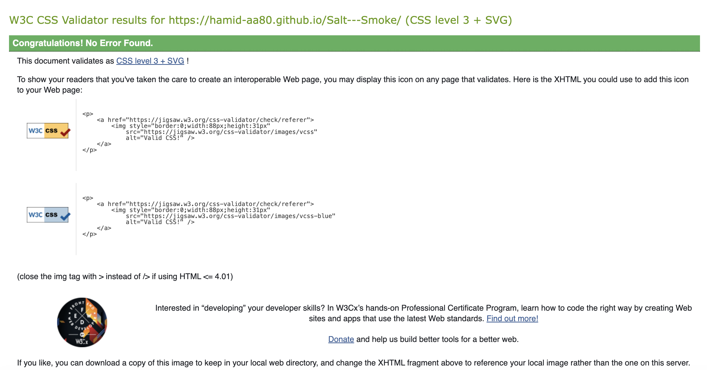
*W3C CSS Validation - Valid styles*

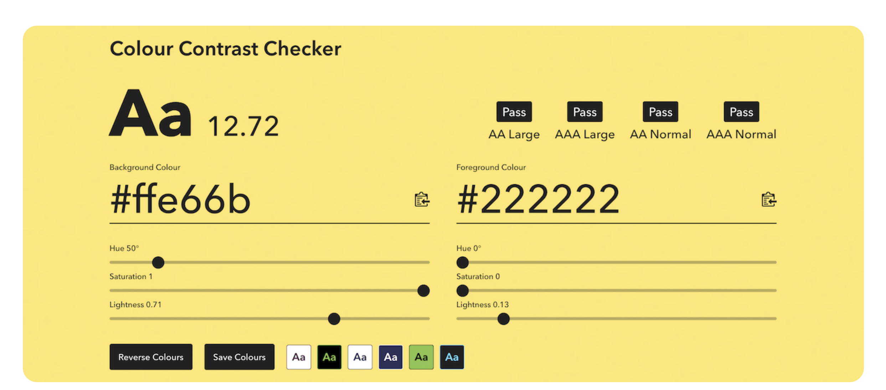
*WCAG Contrast Compliance*

---

## 🌍 Deployment

### Architecture Overview

```
┌─────────────────────────────────────────────────────────────┐
│                     GitHub Pages                             │
│              (Frontend - Static Hosting)                      │
│         https://hamid-aa80.github.io/Salt---Smoke/           │
│                                                              │
│  ┌──────────────┐  ┌──────────────┐  ┌──────────────┐       │
│  │   index.html │  │  style.css   │  │   main.js    │       │
│  └──────────────┘  └──────────────┘  └──────────────┘       │
└────────────────────────────┬──────────────────────────────────┘
                             │ API Calls
                             ↓
┌─────────────────────────────────────────────────────────────┐
│                  Cloud Hosting (Railway/Heroku)              │
│              (Backend API - Node.js/Express)                 │
│                                                              │
│  ┌────────────────────────────────────────────────────┐    │
│  │         Express Server (Port 5000)                 │    │
│  │  /api/health  /api/reservations  /api/menu        │    │
│  │  /api/newsletter  /api/*                           │    │
│  └────────────────┬─────────────────────────────────┘    │
│                   │ Database Operations                    │
│  ┌────────────────↓─────────────────────────────────┐    │
│  │          SQLite Database (database.db)            │    │
│  │  - Reservations - Newsletter - Menu Items         │    │
│  └────────────────────────────────────────────────────┘    │
└─────────────────────────────────────────────────────────────┘
```

### Frontend Deployment (GitHub Pages)

The frontend is automatically deployed to GitHub Pages from the `main` branch:
```
https://hamid-aa80.github.io/Salt---Smoke/
```

**Deployment Process:**
1. Push changes to the `main` branch
2. GitHub Actions workflow triggers automatically
3. GitHub Pages rebuilds and deploys the frontend
4. Live website updates within seconds

### Backend Deployment Options

The backend API can be deployed to multiple platforms:

#### ✅ Quick Start Platforms (Recommended)

| Platform | Setup Time | Cost | Best For |
|----------|-----------|------|----------|
| **Railway** | 2 min | Free tier | Beginners, quick deployment |
| **Render** | 3 min | Free tier | GitHub integration, ease of use |
| **Heroku** | 5 min | $7+/month | Reliability, large apps |

#### 🔧 Manual Deployment Platforms

| Platform | Setup Time | Cost | Best For |
|----------|-----------|------|----------|
| **AWS Lightsail** | 15 min | $3.50+/month | Scalability, performance |
| **DigitalOcean** | 15 min | $4+/month | Simplicity, VPS control |

### Quick Deploy Steps

#### Option 1: Railway (Easiest)
```bash
1. Go to https://railway.app
2. Sign up with GitHub
3. Click "New Project" → "Deploy from GitHub"
4. Select this repository
5. Railway auto-deploys your API!
```

#### Option 2: Render
```bash
1. Go to https://render.com
2. Sign up with GitHub
3. Click "New +" → "Web Service"
4. Connect this repository
5. Set Start Command: npm start
6. Deploy!
```

#### Option 3: Heroku
```bash
# Install Heroku CLI
brew install heroku
heroku login

# Create app
heroku create your-salt-smoke-api

# Deploy
git push heroku main

# View logs
heroku logs --tail
```

### Environment Variables

Set these in your deployment platform's dashboard:
```env
PORT=5000
NODE_ENV=production
DATABASE_PATH=./database.db
```

### Post-Deployment

After deploying the API:

1. **Get your API URL** from the deployment platform
2. **Update Frontend** - Configure the frontend to use your API:
   ```javascript
   // In main.js
   const API_URL = 'https://your-deployed-api.com/api';
   ```
3. **Test API Health**
   ```bash
   curl https://your-deployed-api.com/api/health
   ```
4. **Verify All Features** - Test reservations, newsletter, and menu endpoints

### Full Deployment Guide

For comprehensive deployment instructions, platform-specific guides, and troubleshooting:
📖 See [**DEPLOYMENT.md**](./DEPLOYMENT.md)


---

## ⚙️ Environment Configuration

Create a `.env` file in the root directory:

```env
# Server Configuration
PORT=5000
NODE_ENV=development

# Optional: Database configuration
DATABASE_PATH=./database.db
```

### Environment Variables

| Variable | Default | Description |
|----------|---------|-------------|
| `PORT` | 5000 | API server port |
| `NODE_ENV` | development | Environment (development/production) |
| `DATABASE_PATH` | ./database.db | SQLite database location |

---

## 📝 Available npm Scripts

```bash
# Start the API server
npm start

# Start development server (same as start)
npm run dev

# Run automated tests
npm test
```

---

## 🤝 Contributing

We welcome contributions! To contribute:

1. **Fork** the repository
2. **Create** a feature branch (`git checkout -b feature/amazing-feature`)
3. **Commit** your changes (`git commit -m 'Add amazing feature'`)
4. **Push** to the branch (`git push origin feature/amazing-feature`)
5. **Open** a Pull Request

### Guidelines
- Follow existing code style
- Write meaningful commit messages
- Add tests for new features
- Update documentation as needed
- Ensure all tests pass before submitting PR

---

## 🙏 Credits

### Core Technologies
- [Node.js](https://nodejs.org/) - JavaScript runtime environment
- [Express.js](https://expressjs.com/) - Fast and minimal web framework
- [SQLite](https://www.sqlite.org/) - Lightweight relational database
- [HTML5](https://developer.mozilla.org/en-US/docs/Web/Guide/HTML/HTML5) - Semantic markup language
- [CSS3](https://developer.mozilla.org/en-US/docs/Web/CSS) - Modern styling and animations

### Frontend Libraries
- [Bootstrap 5.3](https://getbootstrap.com/) - Responsive UI component framework
- [Font Awesome 6](https://fontawesome.com/) - Comprehensive icon library
- [Google Fonts - Pacifico](https://fonts.google.com/specimen/Pacifico) - Custom typography
- [WOW.js](https://wowjs.uk/) - Scroll animation library
- [jQuery](https://jquery.com/) - DOM manipulation and utilities
- [animate.css](https://animate.style/) - CSS animation library

### Backend Dependencies
- [CORS](https://github.com/expressjs/cors) - Cross-origin resource sharing middleware
- [body-parser](https://github.com/expressjs/body-parser) - HTTP request body parsing
- [dotenv](https://github.com/motdotla/dotenv) - Environment variable management
- [sqlite3](https://github.com/mapbox/node-sqlite3) - SQLite bindings for Node.js

### Testing & Quality Assurance
- [Playwright](https://playwright.dev/) - Cross-browser end-to-end testing framework
- [W3C HTML Validator](https://validator.w3.org/) - HTML validation
- [W3C CSS Validator](https://jigsaw.w3.org/css-validator/) - CSS validation
- [Google Lighthouse](https://developers.google.com/web/tools/lighthouse) - Web performance auditing

### Development Tools
- [npm](https://www.npmjs.com/) - JavaScript package management
- [Git](https://git-scm.com/) - Version control system
- [GitHub Pages](https://pages.github.com/) - Static site hosting
- [VS Code](https://code.visualstudio.com/) - Code editor

### Inspirations & References
- Restaurant design best practices
- Modern web accessibility standards
- Progressive enhancement principles
- Mobile-first responsive design

### Contributors
- **Hamid** - Project Creator & Developer

---


## 🎉 Acknowledgments

- **Bootstrap 5.3** - Responsive framework
- **Font Awesome** - Icon library
- **WOW.js** - Scroll animations
- **Playwright** - Testing framework
- **Express.js** - Web framework
- **SQLite** - Database

---

**Made with ❤️ by Hamid**

Last Updated: June , 2026
